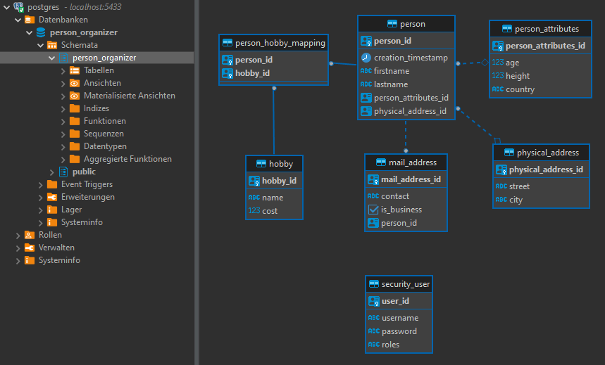
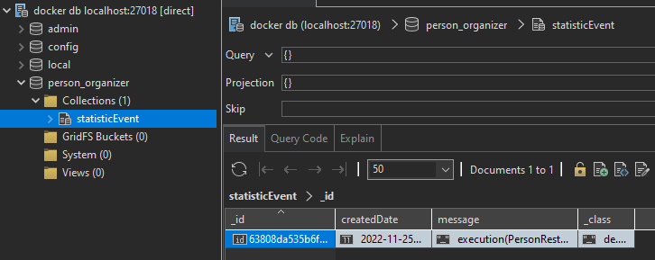

# Databases

### Postgres

Schema (via DBeaver) and mappings:
- OneToOne: person <-> person_attributes
- ManyToOne: person <-> physical_address
- OneToMany: person <-> mail_address
- ManyToMany: person <-> hobby

### MongoDB

Schema (via Studio 3T):

